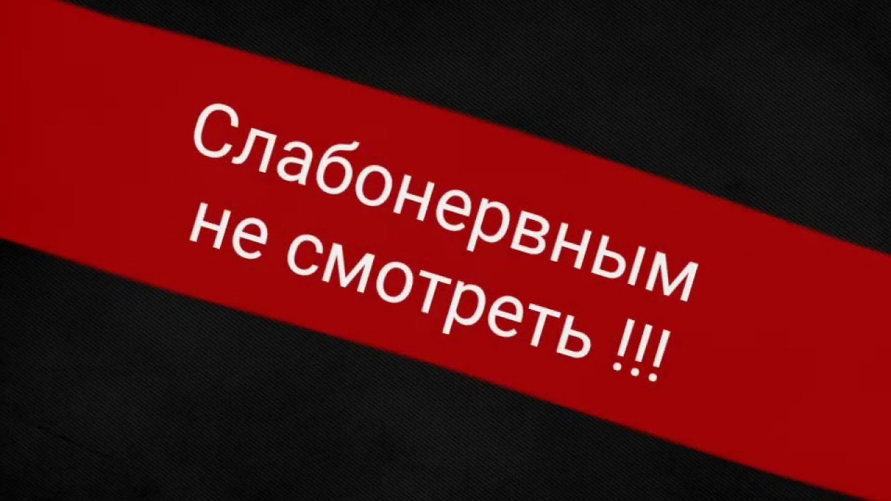

<style>
    h1 {
        color: red;
    }
</style>

# Загаловок

<hr>
## Загаловок 2

Далеко-далеко за **словесными**,  
горами в стране гласных и согласных живут рыбные тексты. Скатился, щеке текст? Меня, дорогу пояс мир злых жаренные свой заглавных коварный, ее что однажды, приставка первую они о силуэт.

```
5 + $1; $5 + $2;
```

> цитатат  
> вторая часть цитаты

[Текст ссылки](https://ya.ru)



таблица  
Столбец 1 | Столбец 2 | Столбец 1
:---------|:---------:|----------:
Значение1 |Что то |Что то
Значение2 |Что то |Что то
Значение3 |Что то |Что то

### **html использование**

<style>
    .block {
        text-align: center;
    }
    .tx {
        font-weight: bold;
        color: red;
    }
</style>

<a href="https://mail.ru">Ссылка</a>

<div class="block">
    <p class="tx">Какой то текст обзацем</p>
</div>
